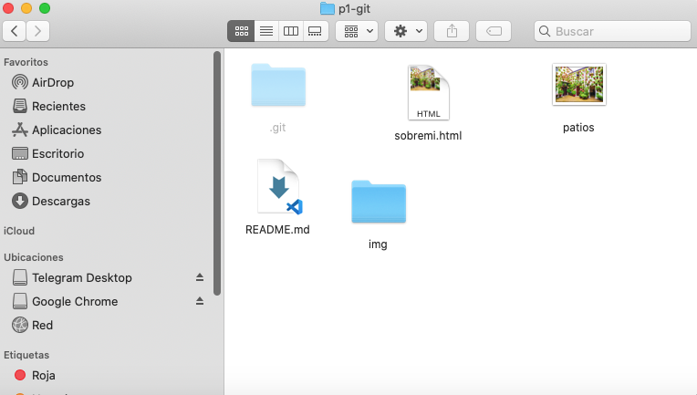
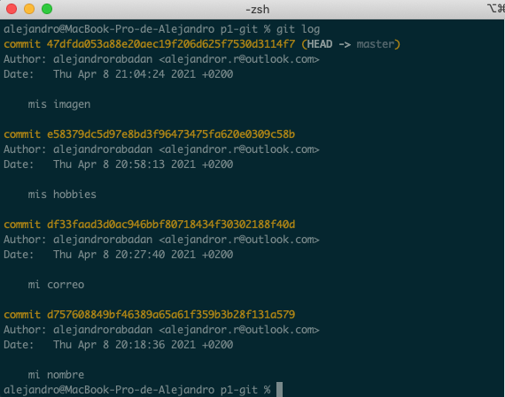
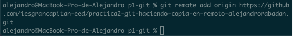
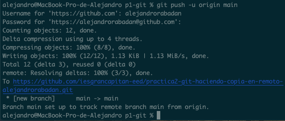

## Tarea4.7
* 1. Estudia el estado del repositorio local: Todos los commits (hasta "mi imagen") y con tu directorio de trabajo limpio (sin ningún cambio por añadir al repositorio). Confirma que no estás en modo detached HEAD (el último commit debe reflejar HEAD -> master). 
 
* 2. Fíjate en las sujerencias de GitHub. Como partes de un repositorio local ya creado, sigue las siguientes instrucciones que te sugiere GitHub... PERO RECUERDA que tu rama NO TIENE POR QUÉ ser la indicada, …or push an existing repository from the command line. 
    * 1. git remote add origin https://github.com/iesgrancapitan-eed/practica2-git-haciendo-copia-en-remoto-lmagarin.git 
    
    
    * 2. git branch -M main 
    
    * 3. git push -u origin main 
    